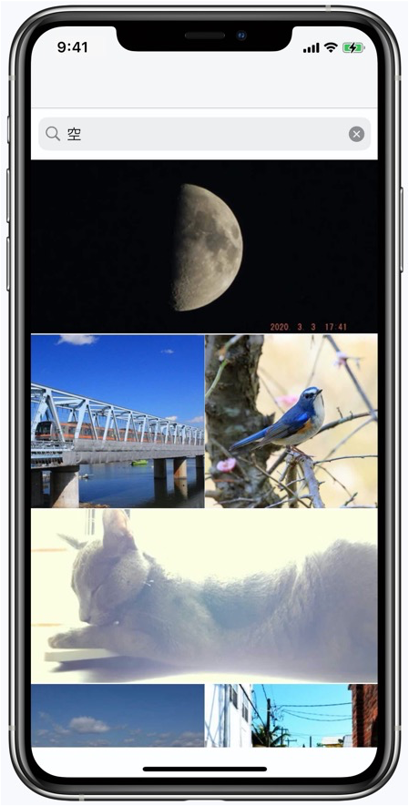

RxSwiftを使ったサンプルコード
====
　
## 開発環境
- Xcode version 12.4
- pod version 1.9.3
- MacOS Catalina version 10.15.7

## 概要
- MVVM + RxSwift, RxCocoaを使った 写真検索アプリ
- WebAPIは[フォト蔵API](http://photozou.jp/basic/api_method_search_public)を使用している

## UI
- 写真検索画面
<td></td>

## メモ

- ポイント
  - 時間（配列要素）／イベント／非同期処理 で構成される
  - 宣言的処理

- イベント種別
  - next（イベントによって生じた値を参照）
  - error（イベントによって生じたエラーを参照）
  - completed（イベント完了を参照）
- イベントを通知する = Observable
- イベントを受け取る = subscribe() -> Disposable （= メモリ解放オブジェクト） 
  - ObservableType.subscribe(_:)はSequence.makeIterator()と同じ

- Observable
  - 生成するメソッド
    - of：定数でObservableを作成
    - from：配列・辞書・集合からObservableを作成
    - create：ゼロからObservableを作成
    - never：イベントを終了しないObservableを作成
    - empty：completedイベントのみを発生するObservableを作成
  - on(_:)メソッドで各イベントで何をするかを定義可能

- データバインド
  - ObservableとViewをバインドさせる
  - Observableのbind(_:)メソッドを使う
  - bind(_:)の引数`to:`にバインドさせるオブジェクトを渡す

- Driver：UIに関する処理
  - errorイベントを受信しない、main threadでイベントを通知してくれるDriverを使うと良い
  - ObservableをDriverに変換するためにはasDriver()メソッドを使う
  - 監視はdrive(_:)を使う

- オペレータ
  - データストリームから得られた値を加工する
  - 種別
    - map
    - filter
    - merge
    - flatMap
    - zip
  - オペレータはメソッドチェーンで複数繋げることが可能

#### 宣言型
何をするのかを記述する

```swift
struct BaseView: View {
  var body: some View {
    VStack {
      Text("タイトル")
      Text("サブタイトル")
    }
  }
}
```

#### 命令型（手続き型）
結果を得るための手順を書く

```swift
class BaseView: UIView {
  init(frame: CGRect) {
    super.init(frame: frame)
    initUI()
  }

  func initUI() {
    let titleLabel = UILabel()
    titleLabel.text = "タイトル"
    titleLabel.translatesAutosizingMaskIntoConstraints = false

    let subTitleLabel = UILabel()
    subTitleLabel.text = "サブタイトル"
    subTitleLabel.translatesAutosizingMaskIntoConstraints = false

    let vstack = UIStackView()
    vstack.axis = .vertical
    vstack.tansilatesAutosizingMaskIntoConstraints = false

    vstack.addArrangedSubView(titleLabel)
    vstack.addArrangedSubView(titleLabel)

    addSubview(vstack)
  }
}
```

## 参考文献
- [RxSwift CodeZine](https://codezine.jp/article/detail/11000)


